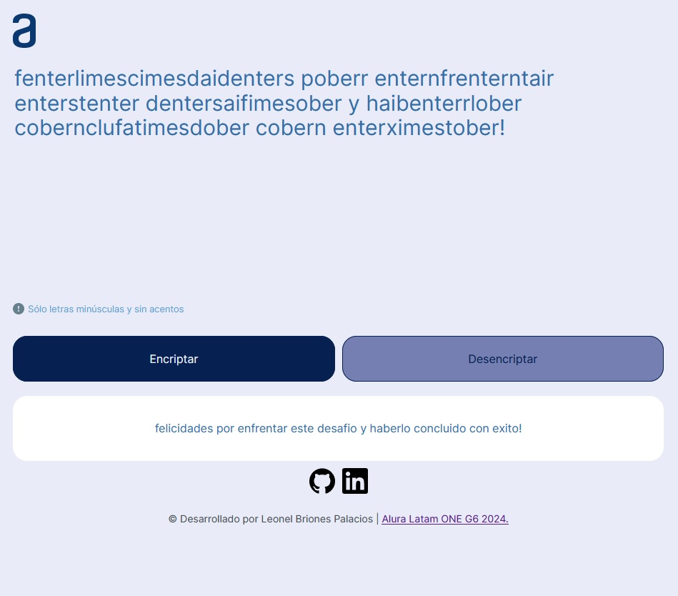

# Desafío 01 - Alura Latam ONE G6
---

Bienvenido al Desafío 01 del programa de educación de Alura Latam ONE en modalidad e-learning.

## Descripción del Proyecto

Este proyecto es una aplicación web que permite encriptar y desencriptar texto. Fue desarrollado como parte del Desafío 01 del Grupo 6 del programa Alura Latam ONE.

## Mensaje Secreto

## Características

- **Encriptación:** Ingresa un texto y obtén su versión encriptada.
- **Desencriptación:** Ingresa un texto encriptado y obtén el texto original.

## Tecnologías Utilizadas

- HTML
- CSS Vanilla
- JavaScript Vanilla

